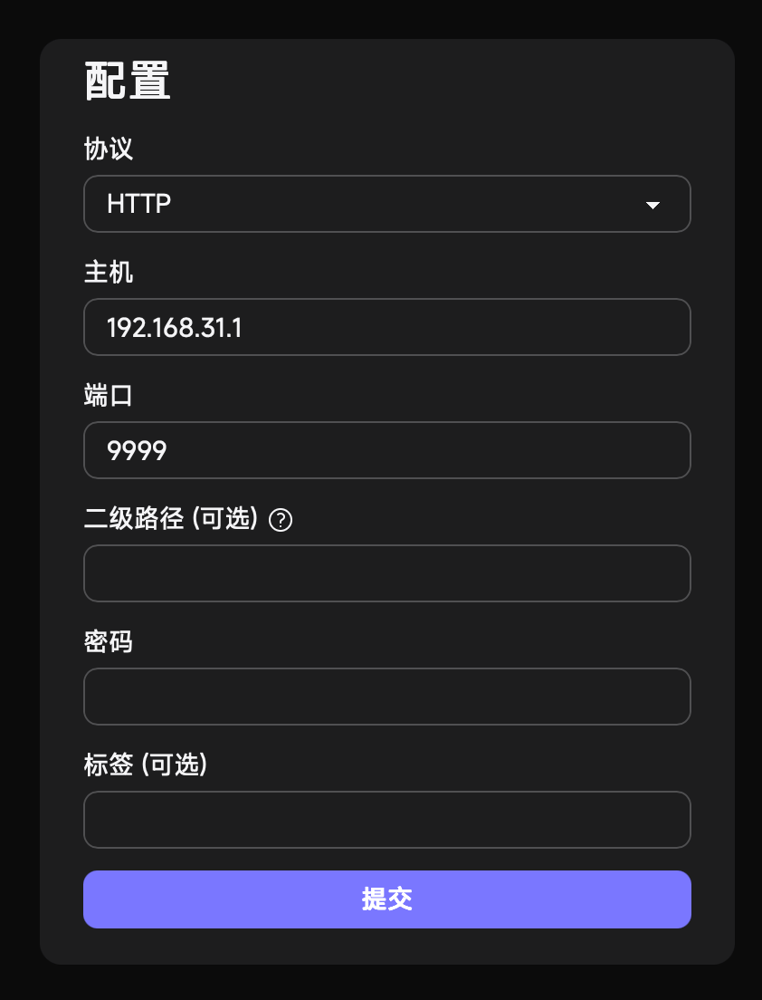

<h1 align="center">小米路由器Singbox裸核使用教程</h1>
<p align="center">
  在小米路由器上使用Singbox裸核配合Tproxy入站,实现局域网透明代理
</p>

<p align="center">
  <a href="README_CN.md">简体中文</a> | English
</p>

---
## TODO List
- 1.解锁路由器SSH,执行软固化  
- 2.下载Singbox核心,编辑配置文件和启动脚本  
- 3.上传文件  

---
## 1.SSH解锁
推荐使用Xmir-patcher项目一键解锁  
[Xmir-patcher](https://github.com/openwrt-xiaomi/xmir-patcher)  

1️⃣下载解压后运行`Run.bat`  
2️⃣选择2,等待几秒钟,出现**SSH is already running**则SSH开启成功  
3️⃣选择6,进行**SSH软固化**

---
## 2.核心,配置,启动脚本准备  
### 1️⃣下载Singbox核心 [Singbox](https://github.com/SagerNet/sing-box/releases)  
请自行确认路由器的CPU架构,下载正确的核心文件  
> [!TIP]
> 请下载带有-musl后缀的文件,否则无法正确运行

### 2️⃣Singbox配置文件编辑
> 下文所述的是在已有配置文件的基础上所需修改的部分,若您还没有一个基础的配置文件,请参阅Singbox的[文档](https://sing-box.sagernet.org/zh/configuration/)先行编写

**配置Tproxy入站**
```
{
   "type": "tproxy",
   "tag": "tproxy-in",
   "listen": "::",
   "listen_port": 7893
}
```

**Clash-api和本地面板配置(非必须,但推荐)**
```
  "experimental": {
    "clash_api": {
      "external_controller": "0.0.0.0:9999",
      "external_ui": "ui",
      "external_ui_download_url": "https://github.com/Zephyruso/zashboard/releases/latest/download/dist-cdn-fonts.zip",
      "secret": "",
    }
  }
```

### 3️⃣Singbox启动脚本
> 以下给出的代码仅供参考,除非你真的熟悉Openwrt上的防火墙配置,请不要轻易改动

新建一个sh文件,并将以下代码黏贴进去
```
#!/bin/sh /etc/rc.common

START=99
USE_PROCD=1

#自行修改为你的Sinbox核心和配置路径
PROG=/mnt/usb-71acc8e1/sing-box/core/sing-box
CONF=/mnt/usb-71acc8e1/sing-box/config.json
ASSESTS=/mnt/usb-71acc8e1/sing-box/assests

start_service() {
    ip rule add fwmark 1 table 100
    ip route add local 0.0.0.0/0 dev lo table 100

    # iptables TProxy 
    iptables -t mangle -N SINGBOX

    #DNS劫持
    iptables -t mangle -A SINGBOX -p udp --dport 53 -j TPROXY --on-port 7893 --tproxy-mark 1
    iptables -t mangle -A SINGBOX -p tcp --dport 53 -j TPROXY --on-port 7893 --tproxy-mark 1

    iptables -t mangle -A SINGBOX -d 192.168.0.0/16 -j RETURN
    iptables -t mangle -A SINGBOX -d 127.0.0.0/8 -j RETURN
    iptables -t mangle -A SINGBOX -d 224.0.0.0/4 -j RETURN
    iptables -t mangle -A SINGBOX -d 255.255.255.255/32 -j RETURN

    #TCP UDP劫持 
    iptables -t mangle -A SINGBOX -p tcp -j TPROXY --on-port 7893 --tproxy-mark 1
    iptables -t mangle -A SINGBOX -p udp -j TPROXY --on-port 7893 --tproxy-mark 1

    iptables -t mangle -A PREROUTING -i br-lan -j SINGBOX

    procd_open_instance
    procd_set_param command $PROG run -c $CONF -D $ASSESTS
    procd_set_param respawn
    procd_set_param stdout 1
    procd_set_param stderr 1
    procd_close_instance
}

stop_service() {
    iptables -t mangle -D PREROUTING -i br-lan -j SINGBOX
    iptables -t mangle -F SINGBOX
    iptables -t mangle -X SINGBOX
    ip rule del fwmark 1 table 100
    ip route del local 0.0.0.0/0 dev lo table 100
}
```

> [!TIP]
> 对于带有Docker的小米路由器,以及高RTT环境下的代理,请参考下方

**Tproxy修复补丁**
```
# 禁用 qca-nss-ecm 中可能修改 bridge netfilter 的 sysctl 设置
# 避免 NSS ECM 或桥接防火墙设置影响 TProxy 流量接管
sed -i 's/sysctl -w net.bridge.bridge-nf-call-ip/#sysctl -w net.bridge.bridge-nf-call-ip/g' /etc/init.d/qca-nss-ecm

# 关闭 bridge 层的 IPv4 / IPv6 iptables 处理
# 避免桥接流量被重复处理或影响透明代理
sysctl -w net.bridge.bridge-nf-call-iptables=0
sysctl -w net.bridge.bridge-nf-call-ip6tables=0
```
将以上代码插入到启动脚本的头部

**TCP缓冲区调整**
```
sysctl -w net.ipv4.tcp_rmem="4096 87380 33554432"
```
对于高RTT网络,不调整TCP缓冲区会导致单连接速度受限。
*如果不理解此处所讲,则请不要修改此参数*  

---
## 3.上传文件  
下载并安装WinSCP  [WinSCP](https://winscp.net/eng/download.php)  
使用SCP连接 默认ip 192.168.31.1 用户名root 密码root  
自行选择Singbox文件存储位置  
***对于带有USB接口的路由器,始终推荐存储在U盘上***  
将核心,配置文件,启动脚本全部上传

---
## 4.启动  
cd至启动脚本位置,并运行
```
./example.sh start
```
打开浏览器,访问[192.168.31.1:9999](http://192.168.31.1:9999)  
按下图配置后端地址  
<div align="center">
  
</div>


